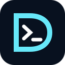

<div align="center">
  
  <h1>Devcanon Website</h1>
  <p><strong>Vibe the idea. Ship it with standards.</strong></p>
  <p>The official product, documentation, Studio, download, and release-history experience for Devcanon.</p>
  <p>
    <a href="https://devcanon-website.vercel.app">Live website</a> ·
    <a href="https://devcanon-website.vercel.app/docs">Documentation</a> ·
    <a href="https://www.npmjs.com/package/devcanon">npm</a> ·
    <a href="https://github.com/KaReeeeeeeeEM/devcanon">CLI repository</a>
  </p>
</div>

---

## What this repository contains

This repository is the public interface for the Devcanon ecosystem. It contains:

- A lightweight Next.js marketing website deployed on Vercel.
- Complete installation and usage documentation for macOS, Windows, and Linux.
- A browser-based preset Studio for generating portable `dc1_` configurations.
- A native Tauri Studio for visually editing local `.ai` handbooks.
- Operating-system-specific desktop download archives.
- Live CLI and desktop release notes sourced from GitHub Releases.
- Search, social-preview, sitemap, structured-data, and PWA metadata.

Devcanon itself remains in the [main Devcanon repository](https://github.com/KaReeeeeeeeEM/devcanon) and is distributed through [npm](https://www.npmjs.com/package/devcanon).

## Product surfaces

| Surface | Purpose |
| --- | --- |
| Landing page | Explains the product, standards model, and supported tooling. |
| Documentation | Routed guides with sidebar navigation and previous/next learning flow. |
| Web Studio | Builds a preset interactively and produces a reusable installation code. |
| Desktop Studio | Opens new or existing projects, edits standards locally, and installs signed updates. |
| Download center | Provides CLI commands and separate macOS, Windows, and Linux release archives. |
| Changelog | Displays published CLI and Studio releases, fixes, notes, and download links. |

## Install Devcanon

Install the global CLI:

```bash
npm install --global devcanon
```

Initialize the current repository:

```bash
devcanon init
```

Run without a global installation:

```bash
npx devcanon init
```

Open the local visual editor:

```bash
devcanon studio
```

See the [installation guide](https://devcanon-website.vercel.app/docs/installation) for complete terminal and desktop instructions.

## Desktop Studio

Devcanon Studio is a local-first Tauri application. It provides:

- A guided launcher for starting a new Devcanon project or opening an existing one.
- Recent project folders in a collapsible, Codex-style sidebar.
- Safe Markdown editing for every standard in `.ai`.
- Non-destructive handbook updates through the installed CLI.
- Signed application update checks against GitHub Releases.
- Download percentage, asset progress, estimated completion time, and installation status.
- A post-update welcome screen populated from the release notes.

The updater validates Tauri signatures before installing an application update. Signing keys are supplied to GitHub Actions through encrypted repository secrets and are never committed.

## Releases and automatic website updates

Publishing a **GitHub Release** updates the website automatically; creating only a Git tag does not.

| Website area | Source | Refresh behavior |
| --- | --- | --- |
| CLI changelog | `KaReeeeeeeeEM/devcanon` GitHub Releases | Revalidated within one hour. |
| Studio changelog | `KaReeeeeeeeEM/devcanon-website` GitHub Releases | Revalidated within one hour. |
| macOS downloads | Matching assets in website releases | Revalidated within one hour. |
| Windows downloads | Matching assets in website releases | Revalidated within one hour. |
| Linux downloads | Matching assets in website releases | Revalidated within one hour. |
| Desktop auto-update | `latest.json` attached to the latest signed Studio release | Checked by the installed app. |

No website code change or Vercel redeployment is required for normal release updates. Next.js revalidation refreshes the release data after the cache window.

### Publish a CLI release

1. Update the version and `CHANGELOG.md` in the Devcanon repository.
2. Merge the protected release pull request.
3. Publish the exact merged commit to npm.
4. Create a matching GitHub Release such as `v2.1.1` with fixes and upgrade notes.
5. Confirm the release appears on `/changelog` after revalidation.

### Publish a Desktop Studio release

Push a version tag after the desktop release changes are merged:

```bash
git tag studio-v1.0.0
git push origin studio-v1.0.0
```

The desktop workflow builds macOS, Windows, and Linux packages, signs updater artifacts, creates the GitHub Release, and uploads `latest.json`. The download pages and installed Studio clients then discover the release automatically.

## Recent improvements and fixes

- Removed hydration-heavy animation libraries from routine page reveals.
- Pre-rendered all documentation topics and added previous/next navigation.
- Added complete CLI and desktop installation guidance for every supported OS.
- Added cache-busted favicon metadata and refreshed service-worker caching.
- Added structured SEO data, canonical URLs, sitemap coverage, and social preview artwork.
- Rebuilt Desktop Studio as a functional local application instead of a web wrapper.
- Fixed the editor appearing underneath the welcome panel.
- Replaced the active sidebar border with a soft primary-color highlight.
- Made release verification version-independent so package bumps cannot hang CI.

## Local development

Requirements:

- Node.js 20 or newer.
- npm for the website workflow.
- Rust and the Tauri platform prerequisites for desktop builds.

```bash
git clone https://github.com/KaReeeeeeeeEM/devcanon-website.git
cd devcanon-website
npm install
npm run dev
```

Open [http://localhost:3000](http://localhost:3000).

### Desktop development

```bash
npm run desktop
```

Create native bundles:

```bash
npm run desktop:build
```

## Verification

Run the website checks before opening a pull request:

```bash
npm run lint
npm run build
npx devcanon check
```

For desktop changes, also run:

```bash
node --check desktop/app.js
cargo check --manifest-path src-tauri/Cargo.toml
```

## Project structure

```text
devcanon-website/
├── .ai/                    Engineering standards used by AI agents
├── .github/workflows/      Verification and desktop release automation
├── desktop/                Offline Desktop Studio interface
├── public/                 Brand and PWA assets
├── src/app/                Next.js routes, metadata, and release pages
├── src/components/         Shared website UI
├── src/lib/                Release and platform definitions
└── src-tauri/              Native Studio commands, bundling, and updater
```

## Engineering standards

This repository was initialized with Devcanon. Before changing implementation, read:

1. [`.ai/AGENTS.md`](./.ai/AGENTS.md)
2. [`.ai/project-rules.md`](./.ai/project-rules.md)
3. Every standard related to the proposed change

Consistency with the existing product language, accessibility, responsiveness, security, and local-first behavior is mandatory.

## Contributing and security

Changes must be made through a pull request. Direct pushes and direct merges to `main` are prohibited by repository policy. Required checks and approval must complete before merge.

- Report implementation problems through [GitHub Issues](https://github.com/KaReeeeeeeeEM/devcanon-website/issues).
- Report sensitive vulnerabilities privately rather than through a public issue.
- Never commit npm tokens, updater private keys, signing passwords, or environment secrets.

## Deployment

The website deploys to Vercel. Pull requests receive preview deployments, and merged changes deploy to production. Vercel is the default deployment target for this Next.js project.

---

<div align="center">
  <strong>Devcanon</strong><br />
  Engineering standards, on command.
</div>
